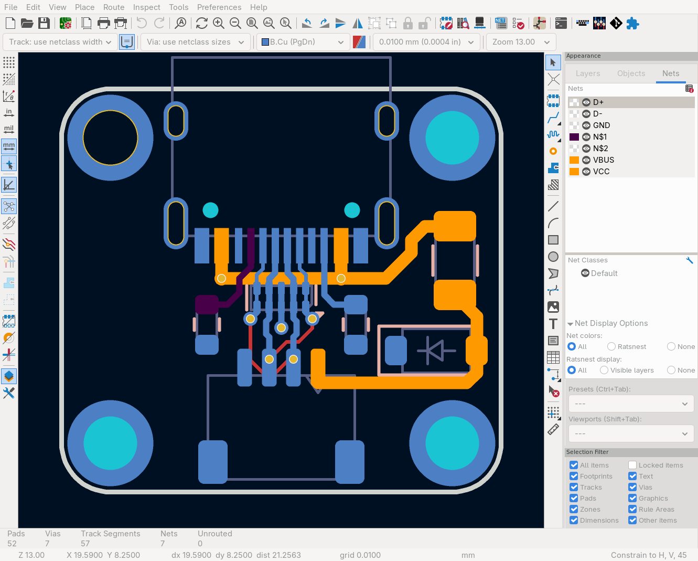

<div align="center">

# kicad-svg-extras

_Generate colored SVG files from KiCad PCB files with advanced styling options._

[](https://github.com/adamws/kicad-svg-extras/actions/workflows/ci.yml)
[](https://adamws.github.io/kicad-svg-extras/)

</div>

## Motivation

The `kicad-svg-extras` tool extends KiCad's built-in SVG export capabilities by adding support for custom net colors, CSS-based styling, and advanced color management. While `kicad-cli` provides basic SVG export, this tool respects per-net color settings defined in your PCB project and offers flexible styling options for web integration.

<table>
    <tr>
        <td colspan="2" align="center"></td>
    </tr>
    <tr>
        <td style="width:50%" align="center"><b>kicad-svg-extras</b></td>
        <td style="width:50%" align="center"><b>kicad-cli pcb export svg</b></td>
    </tr>
    <tr>
        <td align="center"></td>
        <td align="center"></td>
    </tr>
</table>

## Features

1. 🎨 **Color-Aware SVG Generation**
    - **Project Color Integration**: Automatically reads and applies net colors from your KiCad project file
    - **Custom Color Override**: Set specific colors for individual nets via command line or JSON configuration
1. 🌐 **Web-Ready CSS Styling**
    - **CSS Class Generation**: Generate SVGs with CSS classes for each net
    - **Metadata Export**: Export CSS class mappings for easy integration
    - **[Live Interactive Demo](https://adamws.github.io/kicad-svg-extras/)**: Try the web features online
1. ⚙️ **Extra Options**
    - **Fit-to-Content**: Automatic canvas sizing based on board edges
    - **Zone Control**: Option to include or exclude copper zones
    - **Background Customization**: Set custom background colors instead of transparent backgrounds

## Installation

> **Note**: This project is currently in pre-release. It will be published to PyPI soon.

Install using pip:

```bash
pip install git+https://github.com/adamws/kicad-svg-extras.git
```

**Requirements:**
- KiCad (with Python bindings)
- Python 3.8+

The tool automatically detects and imports KiCad's `pcbnew` module from common installation locations,
so it should work in virtual environments without special configuration.

### Custom KiCad Installation Path

If KiCad is installed in a non-standard location, you can specify the path to the pcbnew module
using the `KICAD_PCBNEW_PATH` environment variable:

```bash
export KICAD_PCBNEW_PATH="/path/to/kicad/python/site-packages"
kicad-svg-extras --output board.svg board.kicad_pcb
```

When this environment variable is set, the tool will use it exclusively and will not fall back
to automatic discovery if the path is invalid.

## Usage

<table>
<tr>
<th colspan="2"><b>Basic Usage - Project Colors</b></th>
</tr>
<tr>
<td>

Generate an SVG using colors defined in your KiCad project:

```bash
kicad-svg-extras --output board.svg board.kicad_pcb
```

This automatically:
- Detects the corresponding `.kicad_pro` file
- Applies net colors from the project's `net_colors` settings
- Processes default layers (F.Cu, B.Cu)

</td>
<td>


</td>
</tr>
<tr>
<th colspan="2"><b>Custom Net Colors</b></th>
</tr>
<tr>
<td>

Override specific net colors from the command line
and via `color.json` definition.

```bash
kicad-svg-extras --output board.svg --layers "B.Cu" \
  --ignore-project-colors \
  --net-color "VCC:#fabd2f" --colors colors.json \
  board.kicad_pcb
```

**Supported color formats:**
- Hex: `#FF0000`, `#f00`
- RGB: `rgb(255,0,0)`
- Named: `red`, `green`, `blue`

**colors.json example:**

```json
{
  "net_colors": {
    "N$*": "#b8bb26",
    "VCC": "black",
    "GND": "gray"
  }
}
```

Net names in both `--net-color` and `--colors` json file support wildcards.

</td>
<td>


</td>
</tr>
<tr>
<th colspan="2"><b>CSS Mode for Web Integration</b></th>
</tr>
<tr>
<td>

Generate web-ready SVGs with CSS classes:

```bash
kicad-svg-extras --output board.svg \
  --ignore-project-colors \
  --use-css-classes \
  --export-metadata metadata.json \
  board.kicad_pcb
```

**Creates:**
- **board.svg**: SVG with CSS classes like `.net-gnd-f-cu`
- **metadata.json**: Net-to-CSS mappings

</td>
<td>

</b>
**[Live Interactive Demo](https://adamws.github.io/kicad-svg-extras/)**

</td>
</tr>
</table>

## Command Line Reference

**Basic Syntax:** `kicad-svg-extras -o OUTPUT_FILE [OPTIONS] PCB_FILE`

<table>
<tr>
<th colspan="2"><b>Required Arguments</b></th>
</tr>
<tr>
<td><code>PCB_FILE</code></td>
<td>Input KiCad PCB file (<code>.kicad_pcb</code>)</td>
</tr>
<tr>
<td><code>-o, --output OUTPUT_FILE</code></td>
<td>Output SVG file path</td>
</tr>
<tr>
<th colspan="2"><b>Color Configuration</b></th>
</tr>
<tr>
<td><code>--net-color NET_NAME:COLOR</code></td>
<td>Set color for specific net. Format: <code>net_name:color</code>. Can be used multiple times. Supports hex (<code>#FF0000</code>), RGB (<code>rgb(255,0,0)</code>), or named colors (<code>red</code>).</td>
</tr>
<tr>
<td><code>--colors CONFIG_FILE</code></td>
<td>JSON file with net name to color mapping</td>
</tr>
<tr>
<td><code>--ignore-project-colors</code></td>
<td>Ignore net colors defined in the KiCad project file</td>
</tr>
<tr>
<td><code>-t, --theme THEME_NAME</code></td>
<td>Color theme to use (defaults to PCB editor settings if theme not found)</td>
</tr>
<tr>
<th colspan="2"><b>Layer Selection</b></th>
</tr>
<tr>
<td><code>--layers LAYERS</code></td>
<td>Comma-separated list of KiCad layer names to process (e.g., <code>F.Cu,B.Cu,In1.Cu,In2.Cu</code> or <code>F.Cu,F.SilkS,Edge.Cuts</code>). Default: <code>F.Cu,B.Cu</code></td>
</tr>
<tr>
<th colspan="2"><b>Output Options</b></th>
</tr>
<tr>
<td><code>--use-css-classes</code></td>
<td>Use CSS classes for styling instead of hardcoded colors. Generates individual SVG per net (slower) but allows easy color customization via CSS. Classes: <code>.net-&lt;name&gt; { fill: color; }</code></td>
</tr>
<tr>
<td><code>--export-metadata METADATA_FILE</code></td>
<td>Export net name to CSS class mapping metadata to JSON file. Only useful with <code>--use-css-classes</code>. Contains mapping of actual net names to their CSS class names for integration purposes.</td>
</tr>
<tr>
<td><code>--fit-to-content {none,all,edges_only}</code></td>
<td>Control how bounding box is calculated: <code>none</code> disables fitting (keeps original canvas), <code>all</code> uses all PCB components, <code>edges_only</code> uses only board edges (default)</td>
</tr>
<tr>
<td><code>--no-background</code></td>
<td>Do not add a background to the output SVGs</td>
</tr>
<tr>
<td><code>--background-color BACKGROUND_COLOR</code></td>
<td>Background color for the output SVGs (default: <code>#FFFFFF</code>)</td>
</tr>
<tr>
<th colspan="2"><b>PCB Content Options</b></th>
</tr>
<tr>
<td><code>--skip-zones</code></td>
<td>Skip drawing zones in the output SVGs</td>
</tr>
<tr>
<th colspan="2"><b>Development & Debugging</b></th>
</tr>
<tr>
<td><code>--keep-intermediates</code></td>
<td>Keep intermediate files for debugging</td>
</tr>
<tr>
<td><code>--log-level {DEBUG,INFO,WARNING,ERROR,CRITICAL}</code></td>
<td>Set the logging level (default: INFO)</td>
</tr>
</table>

**Examples**

```bash
# Basic usage with project colors
kicad-svg-extras --output board.svg board.kicad_pcb
# Custom net colors
kicad-svg-extras --output board.svg --net-color 'GND:green' --net-color 'VCC:red' board.kicad_pcb
# Wildcard net patterns
kicad-svg-extras --output board.svg --net-color 'SIGNAL*:blue' board.kicad_pcb
# Using color configuration file
kicad-svg-extras --output board.svg --colors colors.json board.kicad_pcb
# CSS mode for web integration
kicad-svg-extras --output board.svg --use-css-classes --export-metadata metadata.json board.kicad_pcb
# Custom layers and background
kicad-svg-extras --output board.svg --layers "F.Cu,F.SilkS,Edge.Cuts" --background-color "#000000" board.kicad_pcb
# Fit to board edges only, skip zones
kicad-svg-extras --output board.svg --fit-to-content edges_only --skip-zones board.kicad_pcb
```

## How It Works

### Color Priority System

Colors are resolved using a clear priority hierarchy:

1. CLI Arguments (Highest Priority)
2. JSON Configuration File
3. KiCad Project File
4. KiCad Theme Defaults (Lowest Priority)

### Processing Workflow

1. **Net Analysis**: Extract all nets from the PCB and determine which layers they appear on
2. **Color Resolution**: Apply the color priority system to assign final colors
3. **PCB Splitting**: Create filtered PCB files for each net group (same color nets are processed together)
4. **SVG Generation**: Use KiCad's plotting API to generate individual SVGs
5. **Color Application**: Apply colors either as direct fill attributes or CSS classes
6. **Layer Merging**: Combine all layers in the correct stacking order

## Development

### Running Tests

```bash
# Unit tests (no KiCad's pcbnew module required)
hatch run test-unit
# Functional tests (requires KiCad's pcbnew module)
hatch run test-functional
```

## Disclaimer

This project has been mostly AI generated using [claude-code](https://github.com/anthropics/claude-code).
